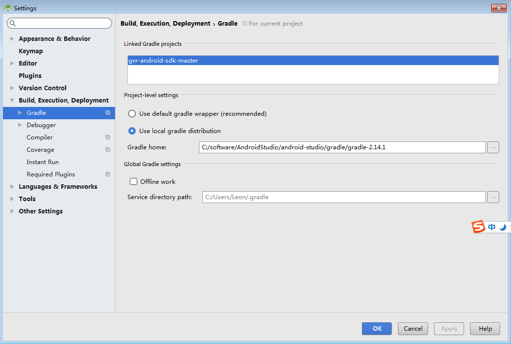
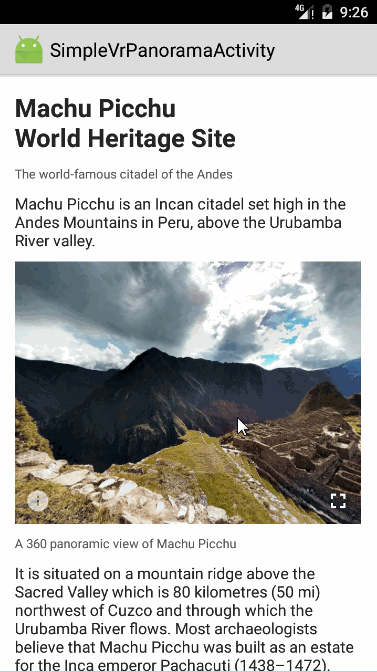
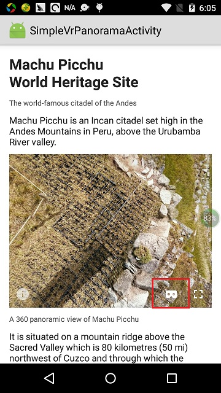
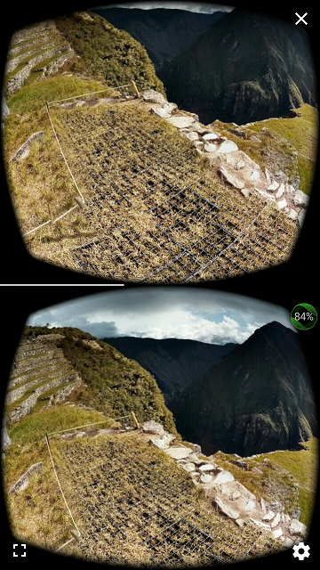
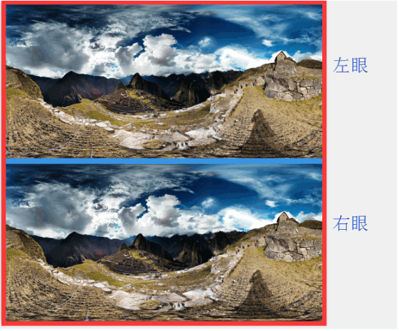
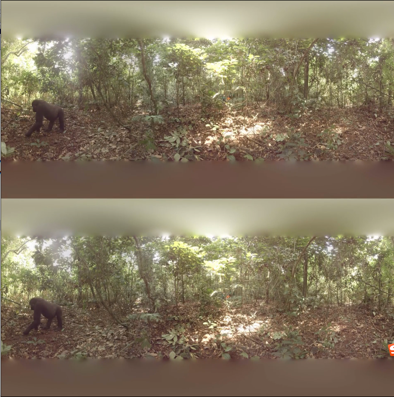
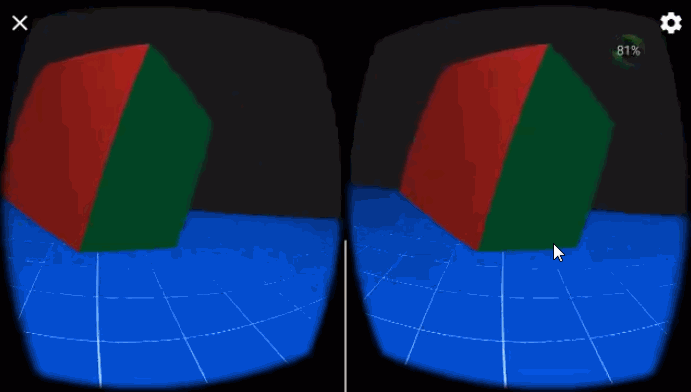

# VR #
虚拟现实（Virtual Reality）技术是一种可以创建和体验虚拟世界的计算机仿真系统，它利用计算机生成一种模拟环境，是一种多源信息融合的、交互式的三维动态视景和实体行为的系统仿真, 使用户沉浸到该环境中。

* [Wikipedia](https://en.wikipedia.org/wiki/Virtual_reality)
* [视频](http://v.youku.com/v_show/id_XMTQ5NTk4ODE2MA==.html?&f=27013492&from=y1.2-3.4.1&spm=a2h0j.8191423.item_XMTQ5NTk4ODE2MA==.A)

# VR产品 #
* [Google VR](https://vr.google.com/)
* [Oculus](https://www.oculus.com/)
* [HTC Vivi](https://www.vive.com/cn/)

# Google VR for Android#
Google VR for Android支持DayDream和Cardboard。

* [Github](https://github.com/googlevr/gvr-android-sdk)
* [Document](https://developers.google.com/vr/android/)
* [API Reference](https://developers.google.com/vr/android/reference_overview)

## SDK下载 ##
使用git命名下载或者直接在github上下载压缩包

	git clone https://github.com/googlevr/gvr-android-sdk.git

## 官方Sample运行 ##
导入gvr-android-sdk到Android Studio, 同步的过程中需要下载很多库所以会比较耗时，另外可能出现build失败的情况，这时可以尝试使用本地的gradle来编译。
grale版本最好为最新版本。

### simplepanowidget ###
simplepanowidget展示了印加文明遗迹马丘比丘的全景图(Panorama)

在真机上运行时，会有一个Cardboard选项。

点击上图红色框中的按钮即可进入Cardboard模式。

Demo代码的主要逻辑就是加载一张全景图放入VrPanoramaView中。

	istr = assetManager.open("andes.jpg");//加载assets目录下的全景图
	panoWidgetView.loadImageFromBitmap(BitmapFactory.decodeStream(istr), panoOptions);

全景图片andes是由两张图片组成，上面一张是给左眼看，下面一张是给右眼看。

### simeplevideowidget ###
simeplevideowidget展示了刚果雨林中大猩猩的360视频。

Demo的核心代码是加载assets目录下的congo.mp4视频到VrVideoView中
    
	videoWidgetView.loadVideoFromAsset("congo.mp4", options);

congo.mp4的视频内容也是分为上下部分，上面给左眼看，下面给右眼看。

### treasurehunt ###
treasurehunt展示了一个简单到离谱的寻宝游戏，当vr世界中矩形变成金黄色时，点击手机屏幕或者使用Daydream的控制器，即可完成寻宝。游戏还伴有音效。

### controllerclient ###
接收DayDream控制器输入示例

### videoplayer ###
使用Asynchronous Rejection播放视频示例

# 全景图（PanoramaActivity） #
## 1. 配置build.gradle ##
	//修改minSDK为19
	minSdkVersion 19
	//添加依赖
	compile 'com.google.vr:sdk-panowidget:1.20.0'

## 2. 配置AndroidManifest.xml ##
由于全景图占内存较大，当加载多张全景图时可能存在内存溢出的情况，所以这里开启largeHeap。

	<application
        android:largeHeap="true">
    </application>

## 3. 加载全景图 ##
	private class LoadPanoramaImageTask extends AsyncTask<Void, Void, Bitmap> {

        @Override
        protected Bitmap doInBackground(Void... params) {
            try {
				//加载assets目录下的全景图片
                AssetManager assetManager = getAssets();
                InputStream open = assetManager.open("andes.jpg");
                return BitmapFactory.decodeStream(open);
            } catch (IOException e) {
                e.printStackTrace();
            }
            return null;
        }

        @Override
        protected void onPostExecute(Bitmap bitmap) {
            VrPanoramaView.Options options = new VrPanoramaView.Options();
            options.inputType = VrPanoramaView.Options.TYPE_STEREO_OVER_UNDER;
            mVrPanoramaView.loadImageFromBitmap(bitmap, options);
        }
    }

## 4. 绳命周期管理 ##
	@Override
    protected void onPause() {
        mVrPanoramaView.pauseRendering();
        super.onPause();
    }

    @Override
    protected void onResume() {
        super.onResume();
        mVrPanoramaView.resumeRendering();
    }

    @Override
    protected void onDestroy() {
        // Destroy the widget and free memory.
        mVrPanoramaView.shutdown();
        // The background task has a 5 second timeout so it can potentially stay alive for 5 seconds
        // after the activity is destroyed unless it is explicitly cancelled.
        if (mLoadPanoramaImageTask != null) {
            mLoadPanoramaImageTask.cancel(true);
        }
        super.onDestroy();
    }

# 360 视频 #
# 1. 配置build.gradle #
	//修改minSDK为19
	minSdkVersion 19
	//添加依赖
    compile 'com.google.vr:sdk-videowidget:1.20.0'
