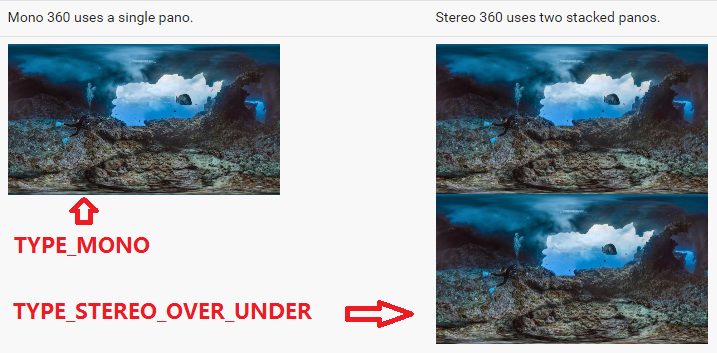
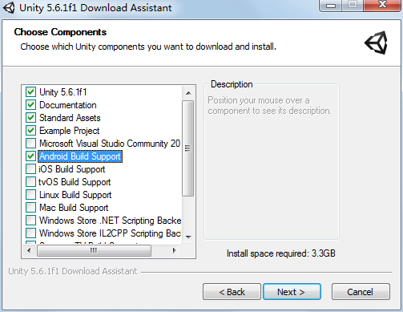
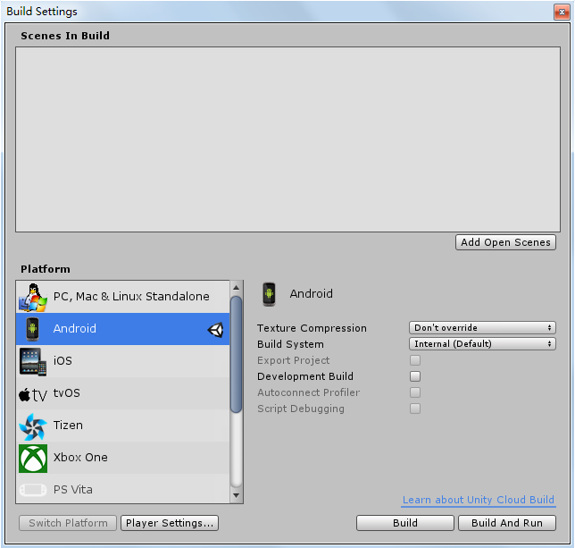
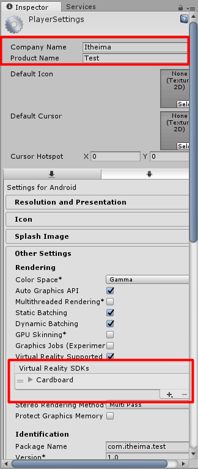
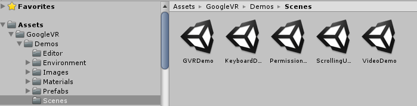

# Github #
[VRDemo](https://github.com/uncleleonfan/VRDemo)

# VR #
虚拟现实（Virtual Reality）技术是一种可以创建和体验虚拟世界的计算机仿真系统，它利用计算机生成一种模拟环境，是一种多源信息融合的、交互式的三维动态视景和实体行为的系统仿真, 使用户沉浸到该环境中。

* [Wikipedia](https://en.wikipedia.org/wiki/Virtual_reality)
* [视频](http://v.youku.com/v_show/id_XMTQ5NTk4ODE2MA==.html?&f=27013492&from=y1.2-3.4.1&spm=a2h0j.8191423.item_XMTQ5NTk4ODE2MA==.A)

# VR产品 #
* [Google VR](https://vr.google.com/)
* [Oculus](https://www.oculus.com/)
* [HTC Vive](https://www.vive.com/cn/)

# Google VR for Android#
Google VR for Android支持DayDream和Cardboard。

* [Github](https://github.com/googlevr/gvr-android-sdk)
* [Document](https://developers.google.com/vr/android/)
* [API Reference](https://developers.google.com/vr/android/reference_overview)

## SDK下载 ##
使用git命名下载或者直接在github上下载压缩包

	git clone https://github.com/googlevr/gvr-android-sdk.git

## 官方Sample运行 ##
导入gvr-android-sdk到Android Studio, 同步的过程中需要下载很多库所以会比较耗时，另外可能出现build失败的情况，这时可以尝试使用本地的gradle来编译。
gradle版本最好为最新版本。

### simplepanowidget ###
simplepanowidget展示了印加文明遗迹马丘比丘的全景图(Panorama)

在真机上运行时，会有一个Cardboard选项。

点击上图红色框中的按钮即可进入Cardboard模式。

Demo代码的主要逻辑就是加载一张全景图放入VrPanoramaView中。

    panoOptions = new Options();
    panoOptions.inputType = Options.TYPE_STEREO_OVER_UNDER;//图像类型为立体图像
	istr = assetManager.open("andes.jpg");//加载assets目录下的全景图
	panoWidgetView.loadImageFromBitmap(BitmapFactory.decodeStream(istr), panoOptions);

全景图片andes是由两张图片组成，上面一张是给左眼看，下面一张是给右眼看。

图片类型

### simeplevideowidget ###
simeplevideowidget展示了刚果雨林中大猩猩的360视频。

Demo的核心代码是加载assets目录下的congo.mp4视频到VrVideoView中
    
	videoWidgetView.loadVideoFromAsset("congo.mp4", options);

congo.mp4的视频内容也是分为上下部分，上面给左眼看，下面给右眼看。

### treasurehunt ###
treasurehunt展示了一个简单到离谱的寻宝游戏，当vr世界中矩形变成金黄色时，点击手机屏幕或者使用Daydream的控制器，即可完成寻宝。游戏还伴有音效。

### controllerclient ###
接收DayDream控制器输入示例

### videoplayer ###
使用Asynchronous Reprojection播放视频示例

# 全景图（PanoramaActivity） #
## 1. 配置build.gradle ##
	//修改minSDK为19
	minSdkVersion 19
	//添加依赖
	compile 'com.google.vr:sdk-panowidget:1.20.0'

## 2. 配置AndroidManifest.xml ##
由于全景图占内存较大，当加载多张全景图时可能存在内存溢出的情况，所以这里开启largeHeap。

	<application
        android:largeHeap="true">
    </application>

## 3. 加载全景图 ##
	private class LoadPanoramaImageTask extends AsyncTask<Void, Void, Bitmap> {

        @Override
        protected Bitmap doInBackground(Void... params) {
            try {
				//加载assets目录下的全景图片
                AssetManager assetManager = getAssets();
                InputStream open = assetManager.open("andes.jpg");
                return BitmapFactory.decodeStream(open);
            } catch (IOException e) {
                e.printStackTrace();
            }
            return null;
        }

        @Override
        protected void onPostExecute(Bitmap bitmap) {
            VrPanoramaView.Options options = new VrPanoramaView.Options();
			//图片类型为立体图像
            options.inputType = VrPanoramaView.Options.TYPE_STEREO_OVER_UNDER;
            mVrPanoramaView.loadImageFromBitmap(bitmap, options);
        }
    }

## 4. 绳命周期管理 ##
	@Override
    protected void onPause() {
        mVrPanoramaView.pauseRendering();
        super.onPause();
    }

    @Override
    protected void onResume() {
        super.onResume();
        mVrPanoramaView.resumeRendering();
    }

    @Override
    protected void onDestroy() {
        // Destroy the widget and free memory.
        mVrPanoramaView.shutdown();
        // The background task has a 5 second timeout so it can potentially stay alive for 5 seconds
        // after the activity is destroyed unless it is explicitly cancelled.
        if (mLoadPanoramaImageTask != null) {
            mLoadPanoramaImageTask.cancel(true);
        }
        super.onDestroy();
    }

## 5. 事件监听 ##
   	mVrPanoramaView.setEventListener(mVrPanoramaEventListener);

    private VrPanoramaEventListener mVrPanoramaEventListener = new VrPanoramaEventListener() {
        /**
         * 点击回调
         */
        @Override
        public void onClick() {
            super.onClick();
        }

        /**
         * 加载数据成功回调
         */
        @Override
        public void onLoadSuccess() {
            super.onLoadSuccess();
        }

        /**
         * 加载数据失败回调
         */
        @Override
        public void onLoadError(String errorMessage) {
            super.onLoadError(errorMessage);
        }
    };

# 360 视频 #
## 1. 配置build.gradle ##
	//添加依赖
	//minSdkVersion 19//已经配置则忽略
    compile 'com.google.vr:sdk-videowidget:1.20.0'

## 2. 配置AndroidManifest.xml (已经配置则忽略)##
	<application
        android:largeHeap="true">
    </application>

## 3. 加载视频 ##

    VrVideoView.Options options = new VrVideoView.Options();
	//视频类型为立体视频
    options.inputType = VrVideoView.Options.TYPE_STEREO_OVER_UNDER;
    try {
        mVrVideoView.loadVideoFromAsset("congo.mp4", options);
    } catch (IOException e) {
        e.printStackTrace();
	}

## 4. 绳命周期管理 ##
    @Override
    protected void onPause() {
        super.onPause();
        // Prevent the view from rendering continuously when in the background.
        mVrVideoView.pauseRendering();
        // If the video is playing when onPause() is called, the default behavior will be to pause
        // the video and keep it paused when onResume() is called.
        isPaused = true;
    }

    @Override
    protected void onResume() {
        super.onResume();
        mVrVideoView.resumeRendering();
    }

    @Override
    protected void onDestroy() {
        // Destroy the widget and free memory.
        mVrVideoView.shutdown();
        super.onDestroy();
    }

## 5. 事件监听 ##

    private VrVideoEventListener mVrEventListener = new VrVideoEventListener() {

        @Override
        public void onLoadError(String errorMessage) {
            Toast.makeText(VrVideoActivity.this, "onLoadError", Toast.LENGTH_SHORT).show();
        }

        @Override
        public void onLoadSuccess() {
            Toast.makeText(VrVideoActivity.this, "onLoadSuccess", Toast.LENGTH_SHORT).show();
        }

        @Override
        public void onNewFrame() {
        }

        @Override
        public void onCompletion() {
            Toast.makeText(VrVideoActivity.this, "onCompletion", Toast.LENGTH_SHORT).show();
            mVrVideoView.seekTo(0);//播放结束后重新开始播放
        }

        @Override
        public void onClick() {
            togglePause();//点击暂停或者播放
        }
    };

# Demo #

该Demo简单展示了全景图控件VrPanoramaView的使用，及其相关的基本的配置。

## 初始化VrPanoramaView ##
    private void initPanoramaView() {
        mVrPanoramaView = (VrPanoramaView) findViewById(R.id.vr_panorama_view);
        //mVrPanoramaView.setDisplayMode(VrWidgetView.DisplayMode.FULLSCREEN_MONO);//全屏模式，弹出一个全屏的Dialog
        mVrPanoramaView.setInfoButtonEnabled(false);//隐藏信息按钮
        mVrPanoramaView.setStereoModeButtonEnabled(false);//隐藏cardboard按钮
        mVrPanoramaView.setFullscreenButtonEnabled(false);//隐藏全屏按钮
        mUrl = getIntent().getStringExtra("url");
        OkGo.get(mUrl).cacheKey(mUrl).tag(mUrl).execute(new BitmapCallback() {

            @Override
            public void onSuccess(Bitmap bitmap, Call call, Response response) {
                VrPanoramaView.Options options = new VrPanoramaView.Options();
                //设置图片类型为单通道图片
                options.inputType = VrPanoramaView.Options.TYPE_MONO;
                mVrPanoramaView.loadImageFromBitmap(bitmap, options);
            }
        });
    }

## 初始化MediaPlayer ##
    /**
     * 如果有音乐数据则播放音乐
     */
    private void initMediaPlayer() {
        String mp3 = getIntent().getStringExtra("mp3");
        if (mp3 != null) {
            mMediaPlayer = new MediaPlayer();
            try {
                mMediaPlayer.setDataSource(this, Uri.parse(mp3));
                mMediaPlayer.setOnPreparedListener(mOnPreparedListener);
                mMediaPlayer.prepareAsync();
            } catch (IOException e) {
                e.printStackTrace();
            }
        }
    }

## 绳命周期管理 ##
	@Override
    protected void onResume() {
        super.onResume();
        mVrPanoramaView.resumeRendering();
    }

    @Override
    protected void onPause() {
        super.onPause();
        mVrPanoramaView.pauseRendering();
        if (mMediaPlayer != null) {
            mMediaPlayer.pause();
        }
    }

    @Override
    protected void onDestroy() {
        super.onDestroy();
        mVrPanoramaView.shutdown();
        OkGo.getInstance().cancelTag(mUrl);//取消请求
        if (mMediaPlayer != null) {
            mMediaPlayer.release();
            mMediaPlayer = null;
        }
    }

# Google VR SDK for Unity #
[Google VR SDK for Unity](https://developers.google.com/vr/unity/get-started)
## 1.下载安装Unity ##
[Unity](https://unity3d.com/cn/get-unity/download)

系统要求

* 操作系统：Windows 7 SP1+、8、10；Mac OS X 10.8+。
* GPU：有DX9（着色器模型2.0）功能的显卡。2004年以来的产品应该都可以。

安装时注意选择“Android Build Support”组件安装。没勾选也没关系，后续使用时在下载安装也可。

## 2.Unity配置Android SDK ##

## 3.下载Google VR SDK for Unity ##
[Google VR for Unity](https://developers.google.com/vr/unity/download#google-vr-sdk-for-unity)

## 4.导入Google VR SDK ##

## 5. Build Settings ##
* File -> Build Settings -> Switch Platform
* Player Settings

## 6. 选择Demo ##
在Assets目录下进入Scenes目录，选择一个Demo，点击运行按钮。按住Alt键并移动鼠标，能360度移动视图。

## 7. 运行 ##
File -> Build Run (预先连接手机)
# License #
	Copyright (c) 2017 uncleleonfan.
	
	Licensed under the Apache License, Version 2.0 (the "License");
	you may not use this file except in compliance with the License.
	You may obtain a copy of the License at
	
	http://www.apache.org/licenses/LICENSE-2.0
	
	Unless required by applicable law or agreed to in writing, software
	distributed under the License is distributed on an "AS IS" BASIS,
	WITHOUT WARRANTIES OR CONDITIONS OF ANY KIND, either express or implied.
	See the License for the specific language governing permissions and
	limitations under the License.

